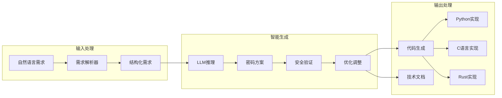
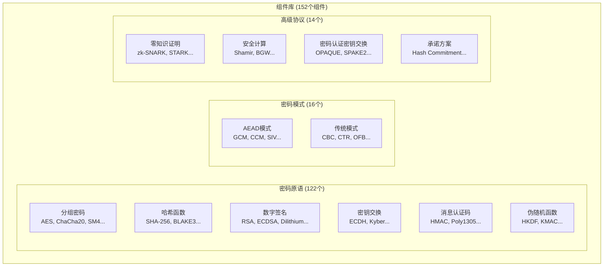
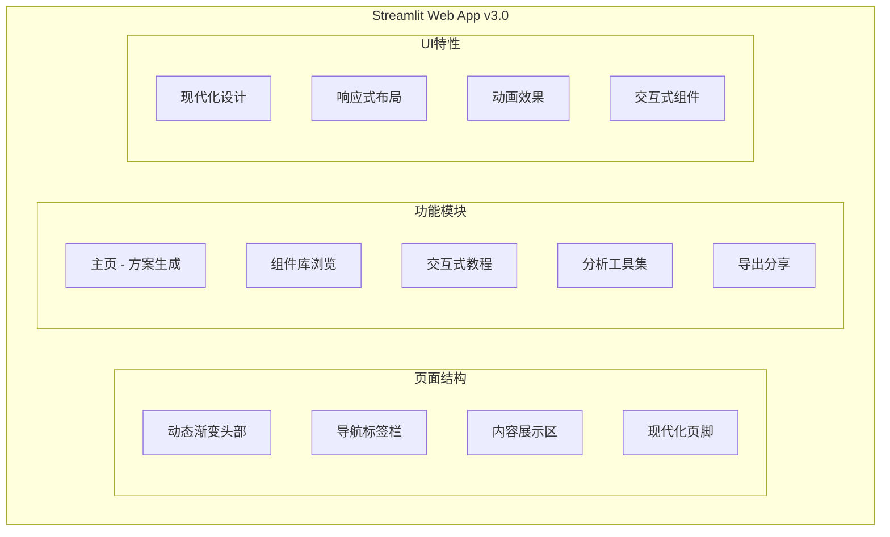
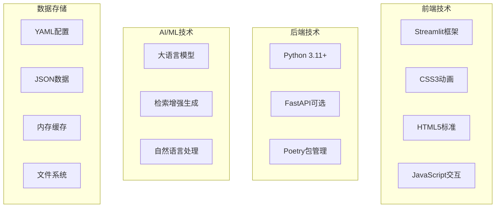
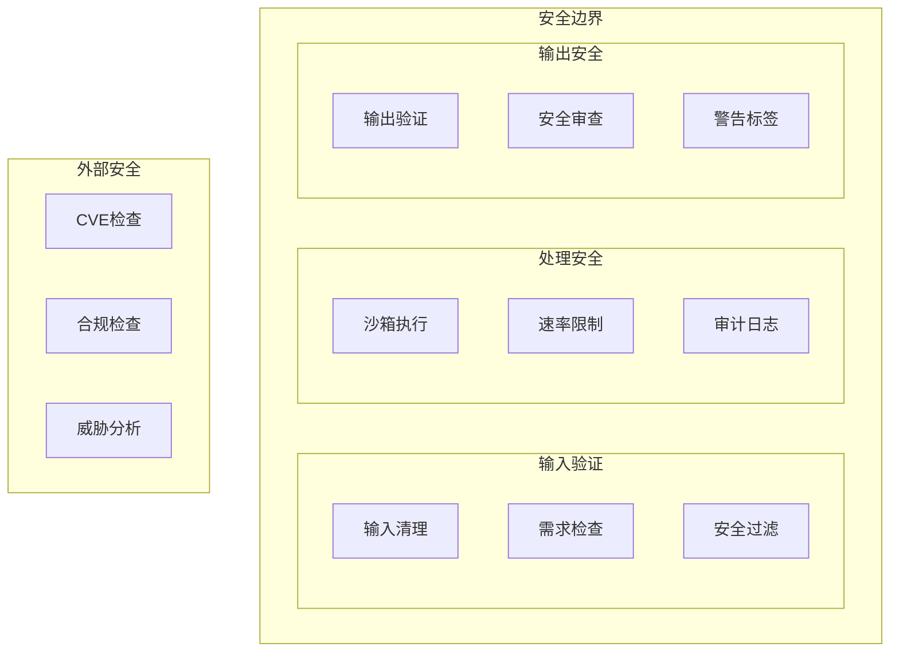

# CipherGenius v3.0 系统框架图

## 整体系统架构

```mermaid
graph TB
    %% 用户界面层
    subgraph "用户界面层 (User Interface Layer)"
        UI[Web Interface v3.0<br/>Streamlit Beautiful UI]
        CLI[CLI工具<br/>命令行界面]
        API[Python API<br/>编程接口]
    end

    %% 应用服务层
    subgraph "应用服务层 (Application Service Layer)"
        Home[主页模块<br/>Scheme Generation]
        Lib[组件库浏览器<br/>Component Library]
        Tut[教程系统<br/>Tutorials]
        Tools[分析工具<br/>Analysis Tools]
        Export[导出分享<br/>Export & Share]
    end

    %% 核心引擎层
    subgraph "核心引擎层 (Core Engine Layer)"
        Parser[需求解析器<br/>Requirement Parser]
        Generator[方案生成器<br/>Scheme Generator]
        Validator[安全验证器<br/>Security Validator]
        Detector[方案检测器<br/>Scheme Detector]
        CodeGen[代码生成器<br/>Code Generator]
    end

    %% 特性功能层
    subgraph "特性功能层 (Feature Layer - 19 Features)"
        subgraph "安全分析"
            SecAssessor[安全评估器<br/>Security Assessor]
            VulnScanner[漏洞扫描器<br/>Vulnerability Scanner]
            ThreatModeler[威胁建模器<br/>Threat Modeler]
            AttackSim[攻击模拟器<br/>Attack Simulator]
        end

        subgraph "性能优化"
            PerfEstimator[性能估计器<br/>Performance Estimator]
            BenchRunner[基准测试器<br/>Benchmark Runner]
            CostEstimator[成本估计器<br/>Cost Estimator]
        end

        subgraph "合规与推荐"
            ComplianceReporter[合规报告器<br/>Compliance Reporter]
            CompRecommender[组件推荐器<br/>Component Recommender]
            SchemeComparator[方案比较器<br/>Scheme Comparator]
        end

        subgraph "教学支持"
            TutorialMgr[教程管理器<br/>Tutorial Manager]
            EnhancedTutorial[增强教程<br/>Enhanced Tutorial]
        end

        subgraph "导出工具"
            SchemeExporter[方案导出器<br/>Scheme Exporter]
        end
    end

    %% 知识数据层
    subgraph "知识数据层 (Knowledge & Data Layer)"
        CompLib[组件库<br/>Component Library<br/>152 Components]
        Papers[论文库<br/>Research Papers]
        Cache[缓存系统<br/>Cache System]
        Config[配置管理<br/>Configuration]
    end

    %% 外部服务层
    subgraph "外部服务层 (External Services Layer)"
        subgraph "LLM提供商"
            OpenAI[OpenAI API]
            Anthropic[Anthropic API]
            ZhipuAI[智谱AI API]
        end

        subgraph "安全数据库"
            CVE[CVE数据库]
            NIST[NIST标准]
        end
    end

    %% 数据流连接
    UI --> Home
    CLI --> Parser
    API --> Generator

    Home --> Parser
    Home --> Generator
    Lib --> CompLib
    Tut --> TutorialMgr
    Tools --> SecAssessor
    Tools --> PerfEstimator
    Export --> SchemeExporter

    Parser --> Generator
    Generator --> Validator
    Generator --> CodeGen
    Generator --> Detector

    SecAssessor --> CVE
    ComplianceReporter --> NIST
    Parser --> OpenAI
    Parser --> Anthropic
    Parser --> ZhipuAI

    Generator --> CompLib
    CodeGen --> CompLib
    TutorialMgr --> Papers

    Parser --> Cache
    Generator --> Cache
    CompLib --> Config

    %% 样式定义
    classDef uiLayer fill:#667eea,stroke:#4c63d2,color:white
    classDef appLayer fill:#764ba2,stroke:#5a3785,color:white
    classDef coreLayer fill:#f093fb,stroke:#d633b3,color:white
    classDef featureLayer fill:#f5576c,stroke:#c41e3a,color:white
    classDef dataLayer fill:#11998e,stroke:#0d7f6e,color:white
    classDef externalLayer fill:#feca57,stroke:#ff9ff3,color:black

    class UI,CLI,API uiLayer
    class Home,Lib,Tut,Tools,Export appLayer
    class Parser,Generator,Validator,Detector,CodeGen coreLayer
    class SecAssessor,VulnScanner,ThreatModeler,AttackSim,PerfEstimator,BenchRunner,CostEstimator,ComplianceReporter,CompRecommender,SchemeComparator,TutorialMgr,EnhancedTutorial,SchemeExporter featureLayer
    class CompLib,Papers,Cache,Config dataLayer
    class OpenAI,Anthropic,ZhipuAI,CVE,NIST externalLayer
```

## 核心模块详细架构

### 1. 需求解析与方案生成流程

### 2. 组件库架构

### 3. Web界面架构

## 技术栈架构

## 安全架构

## 系统特点总结

### 🎯 核心特性
- **152个密码组件**：涵盖原语、模式和协议
- **19个高级功能**：安全分析、性能评估、合规检查等
- **多LLM支持**：OpenAI、Anthropic、智谱AI
- **多语言代码生成**：Python、C、Rust
- **现代化Web界面**：响应式设计、动画效果

### 🔧 技术架构
- **分层设计**：用户界面、应用服务、核心引擎、特性功能、知识数据、外部服务
- **模块化结构**：高内聚低耦合，易于扩展和维护
- **安全优先**：多层次安全验证和防护机制
- **性能优化**：缓存机制、并发处理、资源管理

### 🚀 扩展能力
- **插件化功能**：可动态加载新的分析工具
- **标准化接口**：支持多种LLM提供商
- **灵活配置**：YAML配置文件管理
- **国际化支持**：多语言界面和文档

这个框架图展示了CipherGenius v3.0作为企业级密码方案生成平台的完整技术架构，体现了其在功能完整性、技术先进性和安全性方面的设计理念。