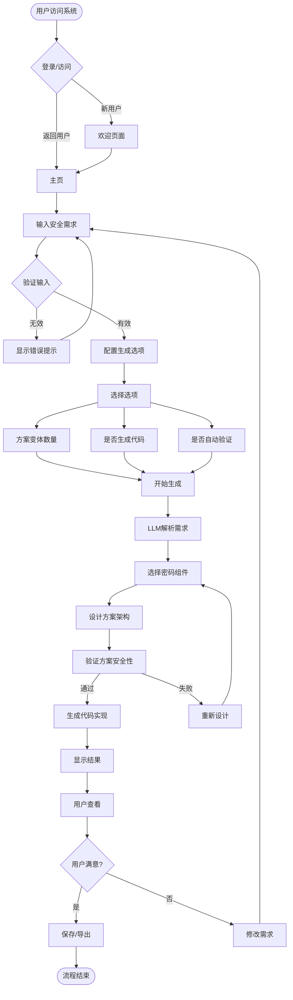
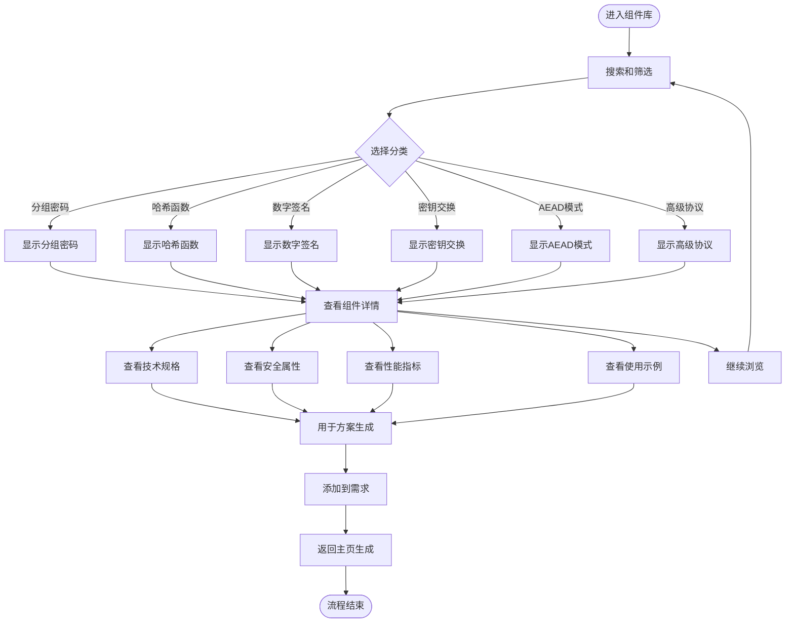
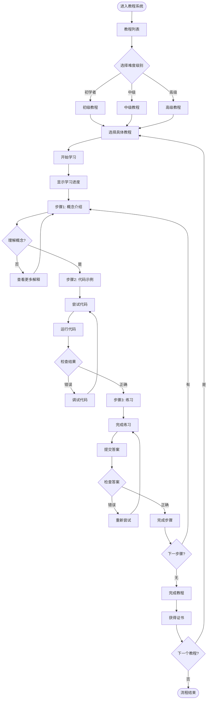
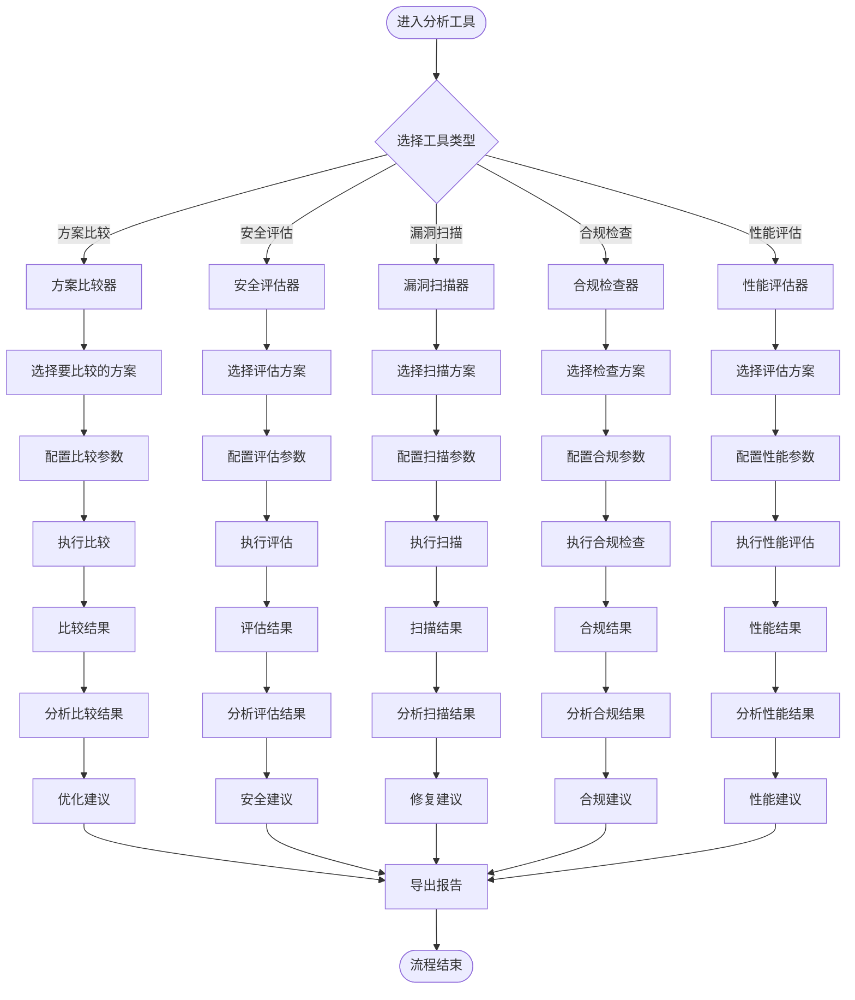
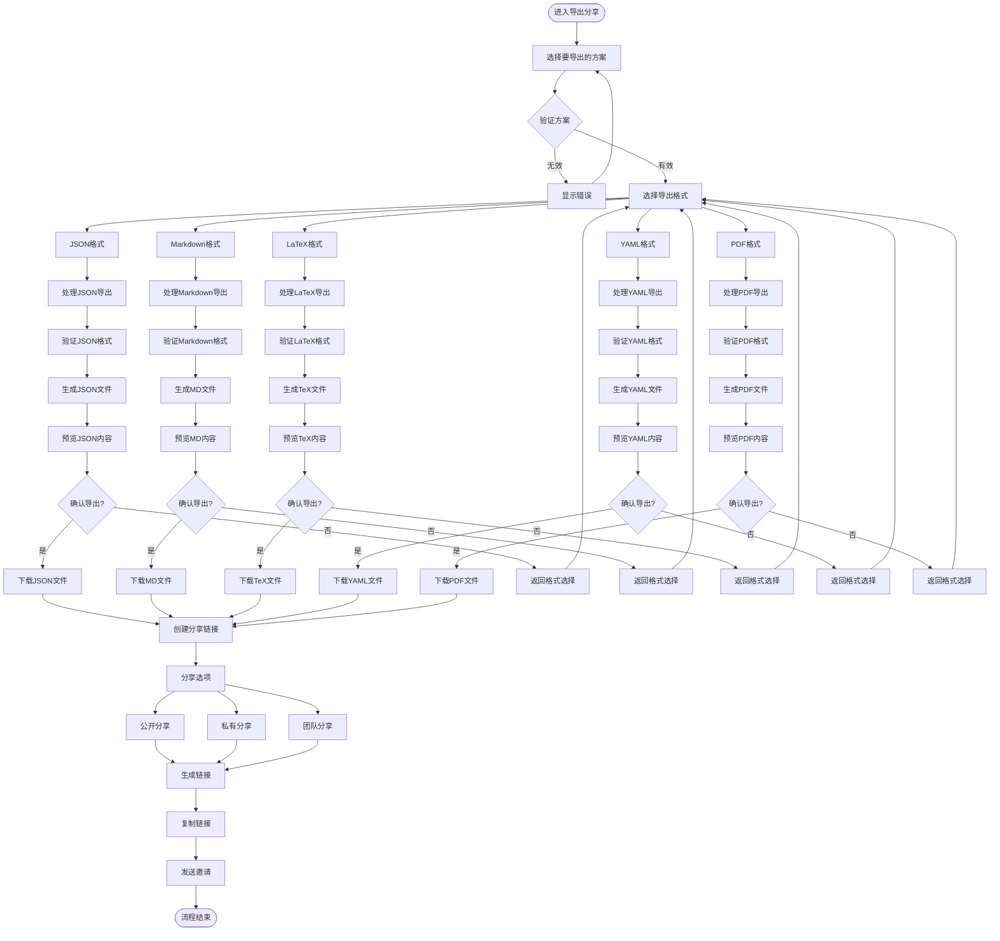
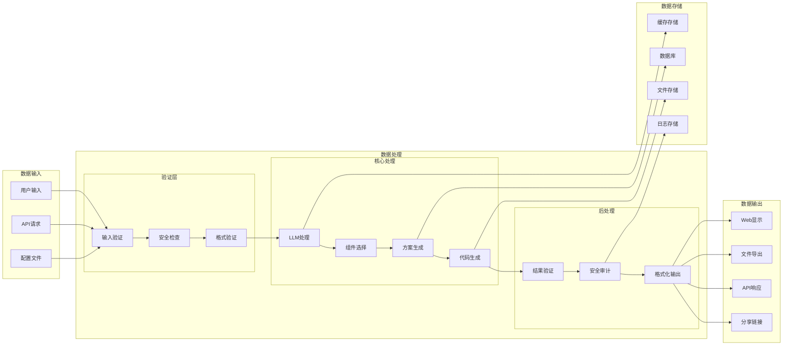
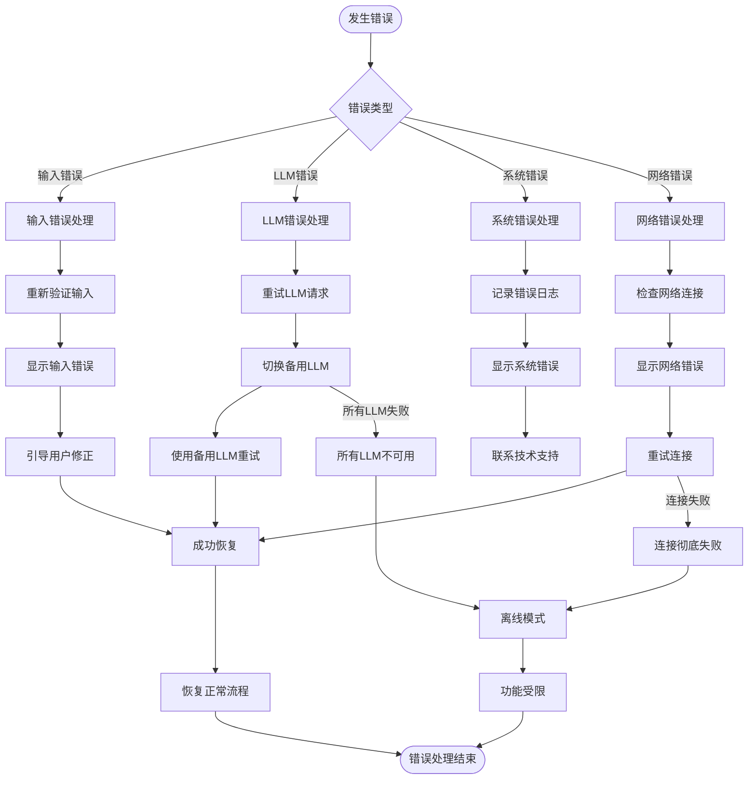
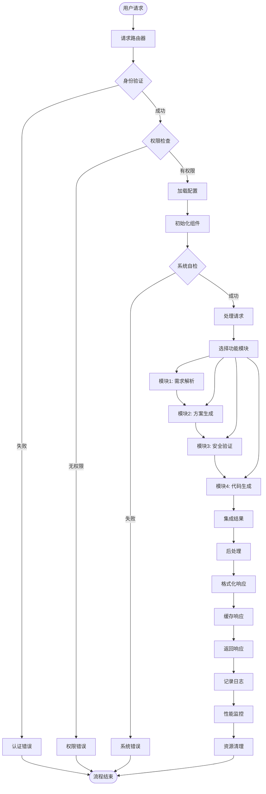

# CipherGenius v3.0 系统流程图

## 主要用户流程

### 1. 密码方案生成主流程

### 2. 组件库浏览流程

### 3. 教程学习流程

### 4. 安全分析工具流程

### 5. 导出分享流程

## 系统数据流程

### 6. 数据流架构

### 7. 错误处理流程

## 系统集成流程

### 8. 多模块协作流程

这些流程图详细描述了CipherGenius v3.0系统各个方面的业务流程，包括用户交互、数据处理、错误处理和系统集成等关键环节，为理解系统的工作机制提供了清晰的视觉指导。